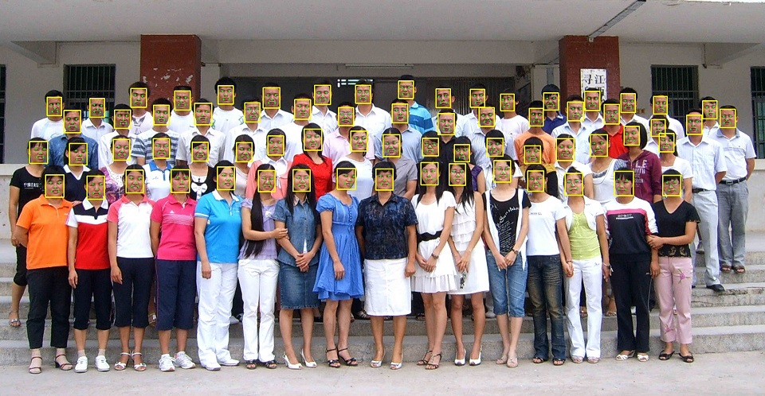

# retinaface_opencv c++
#### 0x00:retinaface opencv版， 基于vs2015
#### 0x01:result:

#### 0x02:官方retinaface(mxnet)
https://github.com/deepinsight/insightface/tree/master/RetinaFace

#### 0x03:caffe版参考
https://github.com/Charrin/RetinaFace-Cpp